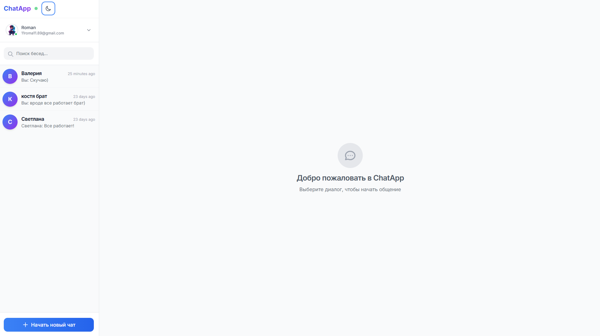

# 💬 ChatApp — Real-Time Premium Messaging



<div align="center">

[](https://nextjs.org/)
[](https://reactjs.org/)
[](https://socket.io/)
[](https://tailwindcss.com/)
[](https://redis.io/)
[](https://www.prisma.io/)
[](https://www.docker.com/)

---

**ChatApp** — это мощная платформа для мгновенного обмена сообщениями, объединяющая скорость Socket.io и надежность PostgreSQL. Современный интерфейс, групповые чаты и статус пользователей в реальном времени обеспечивают премиальный пользовательский опыт.

[Возможности](#✨-возможности) • [Установка](#🚀-быстрый-старт) • [Стек](#🛠-технологический-стек) • [Docker](#🐳-запуск-через-docker)

</div>

---

## ✨ Возможности

- ⚡ **Real-time Messaging**: Мгновенная доставка сообщений без перезагрузки страниц благодаря **Socket.io**.
- 👥 **Групповые и Личные Чаты**: Создание приватных бесед и многопользовательских групп с назначением админов.
- 🟢 **Статусы Пользователей**: Отслеживание Online / Offline / Away статусов в реальном времени.
- 📖 **Квитанции о Прочтении**: Система отслеживания прочтения сообщений участниками беседы.
- 🚀 **Масштабируемость с Redis**: Готовность к высоким нагрузкам благодаря интеграции Redis для синхронизации сокетов.
- 🔐 **Безопасная Аутентификация**: Защита данных с использованием JWT (JSON Web Tokens) и хеширования паролей через bcrypt.
- 👤 **Профили Пользователей**: Возможность настройки аватаров и детальной информации о себе.
- 🐳 **Full Stack Docker**: Полноценное окружение с приложением, базой данных PostgreSQL и кэшем Redis.

---

## 🛠 Технологический стек

### Frontend & Core
- **Framework**: [Next.js 14](https://nextjs.org/)
- **Library**: [React 18](https://react.dev/)
- **Styling**: [Tailwind CSS](https://tailwindcss.com/)
- **Real-time**: [Socket.io-client](https://socket.io/)
- **State Management**: React Hooks & Context API

### Backend & Infrastructure
- **Server**: Custom Node.js server for WebSockets
- **ORM**: [Prisma](https://www.prisma.io/)
- **Database**: PostgreSQL
- **Cache/Broker**: [Redis](https://redis.io/) (ioredis)
- **Security**: JWT & bcryptjs

---

## 🚀 Быстрый старт

### 1. Клонирование и установка
```bash
git clone https://github.com/your-username/chat-app.git
cd chat-app
npm install
```

### 2. Настройка окружения
Создайте `.env` файл (используйте `.env.docker` как шаблон для Docker или настройте локальные БД):
```bash
cp .env.example .env
```
Укажите `DATABASE_URL`, `JWT_SECRET` и параметры Redis.

### 3. База данных
```bash
npx prisma generate
npx prisma db push
```

### 4. Запуск в режиме разработки
```bash
npm run dev
```
Откройте [http://localhost:3000](http://localhost:3000).

---

## 🐳 Запуск через Docker

Самый простой способ запустить весь стек (App + Postgres + Redis):

```powershell
# Запуск всей инфраструктуры
.\start.ps1

# Полная пересборка (при изменении зависимостей)
.\rebuild.ps1

# Остановка
.\stop.ps1

# Сброс данных и миграции
.\reset.ps1
```

**Доступные сервисы:**
- **App**: `http://localhost:3000`
- **PostgreSQL**: `:5432`
- **Redis**: `:6379`
- **Prisma Studio**: `npx prisma studio`

---

## 📂 Структура проекта

```text
chat-app/
├── prisma/             # Схемы Prisma и файлы БД
├── public/             # Статические ассеты
├── src/
│   ├── app/            # Next.js App Router (UI)
│   ├── components/     # Чат-компоненты, боковая панель, сообщения
│   ├── hooks/          # Хуки для работы с WebSocket и Auth
│   ├── lib/            # Утилиты (Prisma, Socket config)
│   └── context/        # Глобальное состояние чата
├── server.js           # Основной сервер с поддержкой Socket.io
├── Dockerfile          # Конфигурация контейнера
└── docker-compose.yml  # Оркестрация сервисов
```

---

## 📄 Лицензия

MIT License. Свободно для использования и модификации.

---
<div align="center">
⭐ Если вам понравился этот чат, поддержите проект звездой!
</div>
